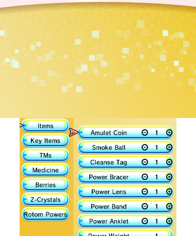

The bag editor is a brand new addition to PKSM starting with 6.0.0. It allows, as you probably already figured out, to modify the items in your bag.

## Navigating the screen

There are a few ways to navigate the main screen.

### Analog controls

Using the `L` and `R` buttons, you can switch between the item category and the item list.

You can move up and down with the d-pad, and moving `left` while on an item will decrease its amount; instead moving `right` will increase it.

Pressing `A` will bring up the item selection screen, you can change the type of item by navigating with the d-pad and pressing `A` on the item you wish to set for that slot.

Pressing `B` will back you out of the item selection screen and not change the item.

### Touch screen

Pressing on the categories buttons on the screen will switch to the desired category, and pressing on the item button will switch you to that item.

Tapping on the plus button will increase the item amount and tapping on the minus button will decrease it. Tapping on the number will bring up a numeric input allowing you to quickly set the item's count to a specific value.

Tapping on an item and then tapping the same item again, will bring up the item selection screen, where you will have to navigate using the d-pad and the `A` button to select the item you wish to set for that slot.

Just like before, pressing `B` will back you out of the item selection screen and not change the item.

> **Note**: you cannot modify Key Items and Z-Crystals.
