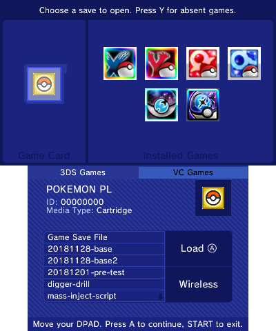
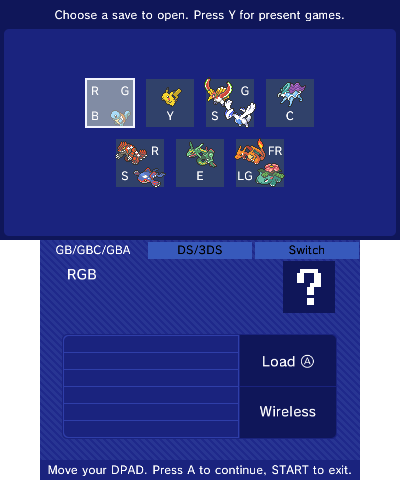
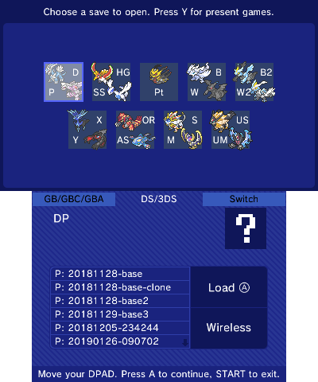
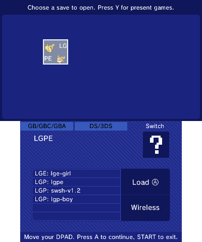
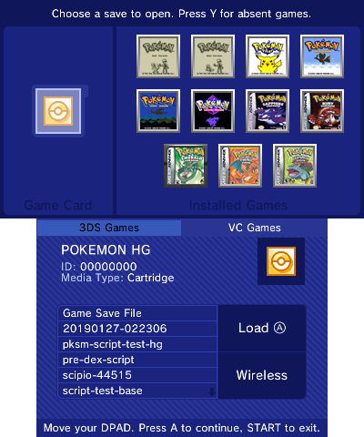
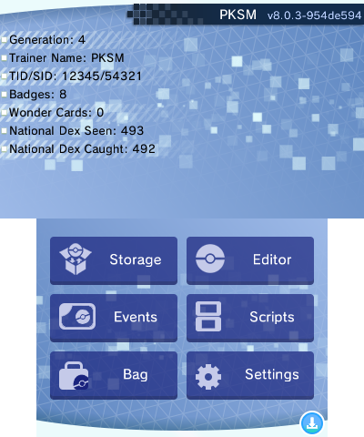

## Getting Started
Using PKSM requires you to have *Custom Firmware* installed on your 3DS. If you are not sure how to satisfy this requirement, click [here](https://3ds.hacks.guide/) for a comprehensible guide.

> **Attention**: launching via *hax entrypoints is not supported due to technical limitations.

## Installation

There are a few options to install PKSM.

### Via QR Code

If you have a reasonably up-to-date version of [FBI](https://github.com/Steveice10/FBI) installed (at least v2.6.0) you can simply scan the QR Code on the PKSM [releases page](https://github.com/FlagBrew/PKSM/releases/latest) using `Scan QR code` under `Remote Install`.

It will automatically install PKSM for you to the home menu.

### Manual installation

+ **Grab the latest release**
  + Download it [here](https://github.com/FlagBrew/PKSM/releases/latest).
  + You will want to download one of the `PKSM.cia` or `PKSM.3dsx` according to your preferences and copy it to your SD card (anywhere is fine). *You do not need **both** files, nor do you need either of the `Source code` options.*
+ **Installation**
  + `PKSM.cia`
    + After the file has been copied to your SD card, put it back into your device and boot up FBI (if you followed the CFW installation guide you will have FBI installed). From there select the SD option, and browse to the location of the `PKSM.cia` file.
    + Once you have found it, press `A` on it, and then press `A` on `Install and delete CIA`, followed by pressing `A` once again to install and then delete the cia file.
    + Once the installation is finished press `A` to back out of the screen and then press `B` until you get to the main menu, and press `START` to exit.
  + `PKSM.3dsx`
    + All you have to do is copy the file to `sdmc:/3ds/PKSM` (make the folders if they don't exist).
    + Once the file is in place, you can open PKSM from the Homebrew Launcher.

> ### Additional Assets
> PKSM requires some additional assets in order to run. If your 3DS has an active internet connection when you first boot PKSM, it will automatically download these by itself.
>
> If you do not have a usable internet connection, you can install them manually by doing the following:
> 1. Download the assets from [here](https://github.com/piepie62/PKResources).
> 2. Copy the assets to `/3ds/PKSM/assets/`. You may need to create the folder(s).
> 3. Launch PKSM, and you should be good to go.

PKSM should now be installed on your device and ready to use!

### Updating
PKSM has an automatic updater built-in so manual updates shouldn't be needed. If you ever find yourself needing to update manually, just follow the [Via QR Code](#via-qr-code) (if you use CIA) or [Manual Installation](#manual-installation) instructions above. Uninstalling your existing version is not necessary--just install the new version over it.


## Running PKSM
### Loading Sequence
When you boot PKSM you will be greeted by a loading screen, where you will see the PKSM icon bouncing around. This is when PKSM is making sure it has all the assets (images) it needs to load the rest of the app.

> **Red Screen**: If you see a red bottom screen instead, please see [Getting Started](#getting-started) for how to continue.

The bouncing icon will eventually be replaced by a series of screens telling you that PKSM is doing the following:

+ **Checking for update**: checking if there is a newer version of PKSM available
+ **Backing up extdata**: If a newer version is found, PKSM backs up your current ExtData (where PKSM saves your settings and storage) as a precaution, in case you need to restore them
+ **Checking for updated gift database**: check if there has been any changes to the Mystery Gift collection PKSM draws from
+ **Loading storage**: loading active storage group (bank)
+ **Scanning SD card**: Scanning for save files to list (game cart, digital titles, Checkpoint backups, configured extra saves)

> **Note for those users upgrading from versions before v8.0.0**: First boot might take a longer time than expected -- this is because PKSM is converting your old format bank to the new version. All of the contents should remain intact, but can take a while depending on the size of your bank.

### Game Selection
After PKSM has finished its loading sequence, you will end up on the following game selection screen. Yours may look different based on what games you have on your console.

<p align="center"></p>

|      Control       | Function                      |
| :----------------: | ----------------------------- |
| d-pad / circle pad | scroll through games or saves |
|         A          | select game or save           |
|         B          | deselect game                 |
|         X          | show PKSM Settings            |
|         Y          | show Absent games             |
|       Select       | (hold) show help overlay      |
|       Start        | Exit PKSM                     |
|        Home        | Return to Home Menu           |

> From this point forward most screens will have a bit of helpful info about the function of things on-screen, which you can view by holding `Select`.

To load a save, first you will have to select the game the save belongs to. If the game is the currently inserted cart or is a 3DS title installed to the Home Menu then you should see it on screen--just navigate to it and press `A`.

Once you've selected a game, control will now switch to the list of saves on the bottom screen. If you want to choose a different game, just press `B` to back out and send control back to the top screen again.

At the top of the list of saves is usually one called `Game Save File`, which is the save currently in the game. Most of the rest will be backups of some kind (Checkpoint, or PKSM if you choose to enable showing them).

You choose a save file by moving your selection to the save you wish to modify followed by pressing `A`.

#### Absent Games
It is also possible to load save files for games you currently do not have installed on or inserted in your console.

To do this, simply press the `Y` button when selecting a game to bring up the absent game save menu.

<p align="center">



</p>

This works the same way as the normal saves screen.

> If the save you want doesn't show up in the list, you can point PKSM to it by configuring [extra saves](./Settings#extra-saves)

#### Virtual Console Games
As of v10.0.0 PKSM supports Virtual Console (VC) versions of all games from Generations 1 through 3.  Official VC copies of Generation 1 and Generation 2 games should be automatically recognized, but all others need to be configured through PKSM's [Title ID settings](./Settings#title-ids) first.

<p align="center"></p>

If you press `R` while on the normal game select screen then the displayed games will change from 3DS Games to VC Games. Pressing `L` will switch the game select screen back to 3DS Games.

#### Loading a Save Over a Network
You can receive a save through Checkpoint's wireless-transfer protocol by tapping the **Wireless** button on the bottom screen. PKSM displays its `IP:port` and a one-time four-digit PIN, then waits for a compatible sender.

In Checkpoint, select the backup and press **Send**, then enter PKSM's address and PIN. The same transfer can be made directly from a computer with Checkpoint's `chlink` tool:

```
chlink send path/to/save-or-backup --to <console-ip>:8000 --pin <PKSM-PIN>
```

PKSM accepts raw save files and the store-only ZIP packages produced by Checkpoint and `chlink`. Once the save loads, edit it normally.

To send the edited save back, tap the save button and confirm the wireless transfer. Start **Receive** in Checkpoint, or run `chlink receive`, then enter the receiver's address and PIN in PKSM. Checkpoint stores the result as a backup; restore it from Checkpoint when you are ready.

```
chlink receive --pin 1234 --out path/to/backups --once
```

**Note**: if sending the edited save fails or is cancelled, PKSM keeps a recovery copy in `sdmc:/3ds/PKSM/backups/wireless`.

> ### Sword and Shield Limitations
> PKSM works with Sword and Shield (SWSH) saves, but only on saves from version 1.3 of SWSH (*Crown Tundra* DLC).  If you are still on an older version of SWSH and want to edit your save, you either need to update your game or you have to transfer your save to a PC and edit it with [PKHeX](https://projectpokemon.org/home/files/file/1-pkhex/).


### The Main Menu
Once you select a save file, it will be backed up based on your configurations and then you will be brought to the main menu.

<p align="center"></p>

Navigating the main menu of PKSM is very simple. All you have to do is tap one of the buttons on the touch screen to choose what you wish to do.

To back out of a menu and return to the game selection screen, you just have to press `B`.

### Saving Your Changes
As of v8.0.0, in order to save your changes to your save file you have to press the small circular button in the bottom-right of the touch screen.

If you try to return to the game selection screen without saving changes, PKSM will ask if you want to continue without saving.
