The Editor is a powerful tool: it allows you to not only edit existing Pokemon, but also allows you to generate new ones as well.

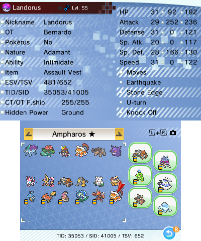

> A couple notes:
> - Most screens in this section come with a bit of help that can be viewed by holding `Select`.
> - You need to have received your starter before PKSM will let you use this in the save file.

## Generating a New Pokemon
To create a new Pokémon, move your cursor over an empty slot of a box and press `A`. PKSM will ask you to choose a species.

> Nothing made this way will be legal as-is. You will need to perform a bit of manual editing to at least give it proper moves, and most likely other things.

### QR Code scanner
You can also generate a Pokemon to your boxes scanning a QR Code that is generated from PKHeX.

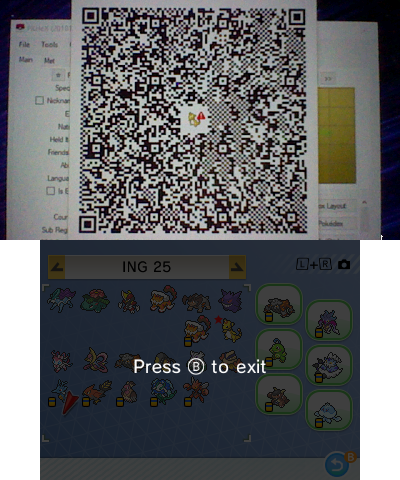

Pressing `L + R` will enable the QR Scanner. Hovering the camera onto the QR code will do the trick. Whether scanning the QR creates a new Pokémon or replaces an existing one depends on if your cursor is hovering over an empty slot.

> A couple notes about QRs:
> - The generation of the QR *MUST* match the generation of your loaded save.
> - Because of the 3DS's poor camera, larger QRs (like those for Generation 7 Pokémon) may take a few tries to scan

## Editing an existing Pokemon
To edit an existing Pokémon, move your cursor over it and press `A`. This will bring up a screen that looks like this:

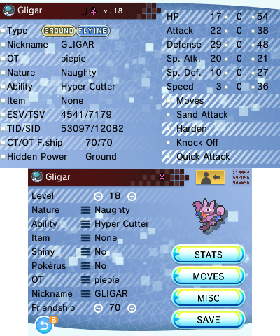

The top screen is basically just a summary of the Pokémon's details, like you'd see in-game (but it shows some values that the game hides). Most of the info is self-explanatory, but here's some clarification on a few that might not be clear:

- **Generation symbol**: shows the generation of the game the Pokémon originally came from
- **Gender**: the pink and blue symbols should be obvious, the green symbol means the Pokémon is genderless
- **Pokerus status**: A purple `PKRS` icon will appear if it is infected, and a purple face if it is cured
- **OT**: the Original Trainer's name
- **ESV/TSV**: Egg Shiny Value/Trainer Shiny Value
- **TID/SID**: Trainer ID/Secret ID
- **CT/OT F.ship**: Current trainer/Original trainer friendship
- **Stats**: The first column is the IVs, the second column is the EVs, and the third is the final stat.

The bottom screen is where you'll actually be making all your edits. From this first screen, you can edit the following:

- **Species** - tap the species name in the top-left to bring up the species choice menu on the top screen
- **Ball** - tap the ball sprite to bring up the ball choice menu on the top screen (see screenshots below)
- **Gender** - tap the gender symbol to cycle through the three gender options (Male > Female > Genderless > Male)
- **Form** - tap the Pokémon sprite to bring up the form choice menu on the top screen
- **Level** - tap the plus to increase, minus to decrease, or the number to set it directly
- **Nature** - tap the `≡` to bring up the nature choice menu on the top screen (see screenshots below)
- **Ability**  - tap the `≡` to cycle through the Pokémon's natural abilities
- **Held item** - tap the `≡` to bring up the item choice menu on the top screen (see screenshots below)
- **Shiny status** - tap the `≡` to toggle the Pokémon's shiny status
- **Pokerus status** - tap the `≡` to toggle the Pokémon's Pokérus status between infected and not infected
- **OT** - tap the `≡` to bring up the keyboard to type in a new value
- **Nickname** - tap the `≡` to bring up the keyboard to type in a new value
- **Friendship level** - tap the plus to increase, minus to decrease, or the number to set it directly

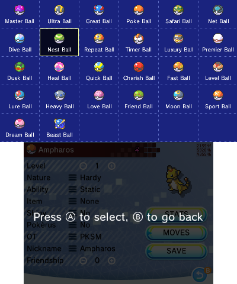
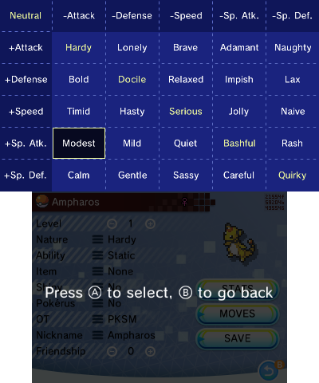
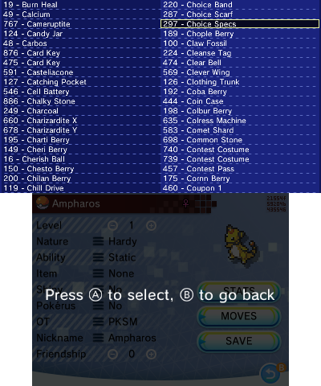

There are also 6 additional buttons on the screen. Some of them will take you to another screen in the editor, which are explained in more detail in their own sections below. To return to this screen after entering a different part of the editor, press `B`.

While the buttons in the bottom-right are pretty easy to understand, the ones in the upper-right might not be:

- **Set OT Info**: The *orange button* with a person and an arrow is a shortcut way to set the Pokémon's OT info (name, TID, SID, and gender) to match the save you have loaded.
- **Hex Editor**: Tapping the button that looks like a *block of purple numbers* will take you to the hex editor, an advanced (and less user-friendly) view of the Pokémon, where you can edit anything about it. There's enough going on here that there's a separate page specifically about the [hex editor](./Hex-Editor) that explains things in better detail (hopefully).

## Stats
Pressing the `Stats` button only changes the bottom screen. It shows essentially the same as the stat summary as the top screen, but you can interact with the IVs and EVs columns to change the values.

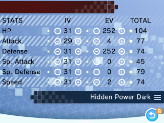

As with the Level on the previous screen, the plus buttons increase the value, the minus buttons decrease it, and tapping on the value itself brings up a number pad for you to input exactly the value you want (within the acceptable range).

Below the stats is a Hidden Power type editor. Tapping the `≡` will bring up the type selection menu on the top screen.

> **Be warned**: changing the type will likely change your IVs a bit, due to IVs being what decides Hidden Power's type (see [Bulbapedia's page](https://bulbapedia.bulbagarden.net/wiki/Hidden_Power_(move)/Calculation) on the topic for an explanation).

## Moves
Pressing the `Moves` button changes the bottom screen to show two sets of move lists--one for the Pokémon's current moves (top) and one for the Pokémon's set of relearnable moves (bottom). Pressing `A` brings up the move selection menu on the top screen, as seen in this screenshot.

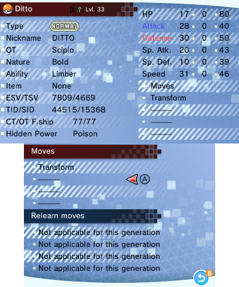
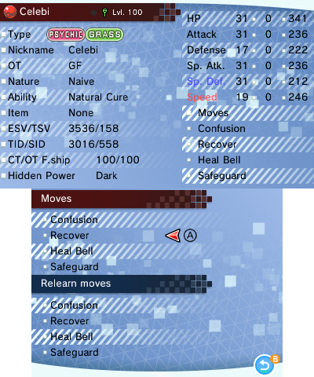
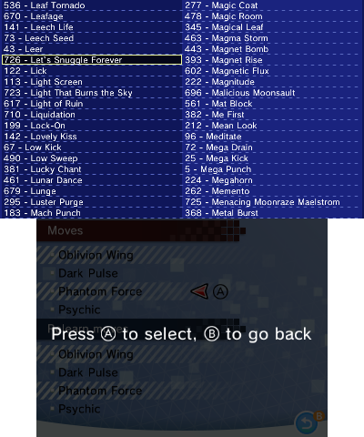

> For generations below 6, you cannot interact with the Relearn Moves list because it didn't exist for those games.

## Misc
Pressing the `Misc` button changes the bottom screen to look list various bits of met info.

At first the info will be related to the OT (original trainer - the player who originally caught or hatched the Pokémon) but by pressing the `CT/Egg Data` button you can change it to info relating to the current trainer (CT) and egg info. Pressing `OT/Met Data` will return to the OT info.

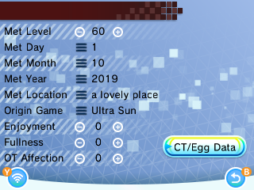
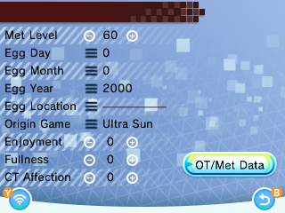

The bottom screen allows you to change the following:
- **Met Level** - tap the plus to increase, minus to decrease, or the number to set it directly
- **Met or Egg Day** - tap the `≡` to bring up the number pad to type in a new value
- **Met or Egg Month** - tap the `≡` to bring up the number pad to type in a new value
- **Met or Egg Year** - tap the `≡` to bring up the number pad to type in a new value
- **Met or Egg Location** - tap the `≡` to bring up the location choice menu on the top screen
- **Origin Game** - tap the `≡` to bring up the game choice menu on the top screen
- **Enjoyment** - tap the plus to increase, minus to decrease, or the number to set it directly
- **Fullness** - tap the plus to increase, minus to decrease, or the number to set it directly
- **OT or CT Affection** - tap the plus to increase, minus to decrease, or the number to set it directly

Tapping the wireless symbol in the bottom-left, or pressing `Y`, will trigger a legality check on your Pokémon.

> [!IMPORTANT]  
> Legality checking/Auto legality requires an active internet connection and for you to be running local-gpss, [see the guide here](https://github.com/FlagBrew/local-gpss/wiki/Server-Setup-Guide)

When the check completes, a message will pop up on the bottom screen. If nothing could be found wrong with your Pokémon, the message will simply be `Legal!`. If your Pokémon fails the legality check, the response will tell you what is wrong. It will also include an extra button in the bottom-left that will send your Pokémon back to the server to ask it to try fixing the errors. Due to restrictions, legality fixing requires you to *manually* make sure the following are legal:

- Ability
- Item
- Level
- Moves
- Nature
- Shininess

> **Note**: the legality checking uses PKHeX's checking method. If PKHeX and PKSM's legality analyses differ, report it on the FlagBrew Discord so that we can fix it.

### GPSS Mobile Integration
> [!IMPORTANT]  
> GPSS Mobile was discontinued as of February 2025 and removed in PKSM 10.1.2

Starting with v9.0.0 it is possible to connect PKSM on your 3DS to GPSS Mobile running on your Android device.

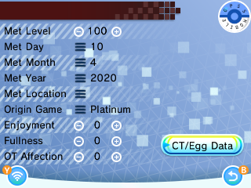

When you tap the GPSS Mobile icon in the upper right of the Misc screen, a couple things will appear on the screen:

- **QR code**: This is a special QR code that's meant to be scanned with GPSS Mobile. When scanned, GPSS Mobile will attempt to legalize the Pokémon and generate a QR of the result
- **Scan legal QR**: this button brings up PKSM's QR scanner to scan the legalization result from GPSS Mobile
- **Legalize Over Network**: Allows sending the loaded Pokémon over your local network (via socket communication) to be legalized on another device.

## Saving your changes
Once you have finished making your changes, make sure to press the `SAVE` button in the main editor screen.

If you attempt to exit without saving, the editor will prompt you if you wish to exit without saving your changes. Pressing `A` will discard your changes. Pressing `B` will return you to the editor screen where you'll be able to press the `SAVE` button again to save your changes.
