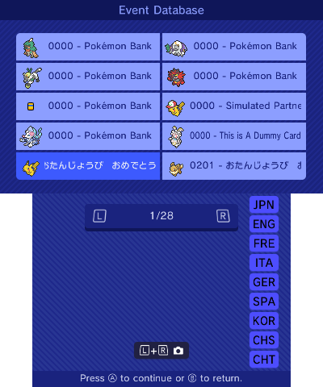
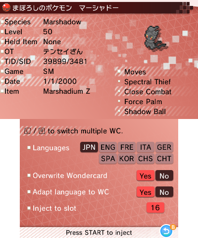

The event injector allows you to inject wondercards into your save file.

You can navigate the cards on the top screen by using the dpad (and if you want to quickly switch between pages, use the `L` and `R` buttons)

The buttons on the lower screen allow you to filter Wonder Cards by language. If a Wonder Card has that language available, it will show up. It is currently only possible to select one language at a time.

Once you have found a card you wish to inject, press `A` to bring up the card, followed by pressing `START` to inject it.

You have a couple options that you can enable or disable before scanning a wondercard:

+ **Languages**: if the wondercard is available in different languages, you can choose the language to inject it with.
+ **Overwrite Wondercard**: this option allows you to overwrite the wondercard in the displayed slot by the one currently selected.
+ **Adapt language to WC**: this allows you to change the save file language to be the same as the selected wondercard.
+ **Inject to slot**: This allows you to select the slot where to inject the selected wondercard.
  + By pressing that button, you're also allowed to dump your wondercards by pressing `X`.

In case a wondercard entry contains multiple sub-wondercards, you can switch between them by using `L` and `R`.

## Missing Events
As of v10.0.0 PKSM's Events section does not support Generations 1 through 3, LGPE, or SwSh. Details on some of these can be found below, but asking for support to be added will get you nothing but frustration.

For all of the other supported games, all released events should be included in the Events section. If you find an event in [this collection](https://github.com/projectpokemon/EventsGallery) that is not in PKSM, please [report it](https://github.com/FlagBrew/PKSM/issues) so we can update our bundling script.

### Generation 3
Events during Generation 3 that gave out Pokémon distributed them via in-game trades so no Wondercard format exists for any of these events. Your only option for getting any of these is to find a `.pk3` file and inject it using the `injector.c` script.

As for the items that were given out, these can be added to your save by running the `RSEFrLg - Inject Tickets.c` and selecting the ticket(s) you wish to inject.

### Let's Go
Due to LGPE events directly injecting the gift Pokémon into the recipient's boxes, they are fundamentally different from the events of Generations 4-7 (which have a delivery person appear in-game whom you talk to in order to receive the gift). As of v10.0.0 there are no plans to implement LGPE events into PKSM, but things may change if work ever progresses on a Switch port of the application.
