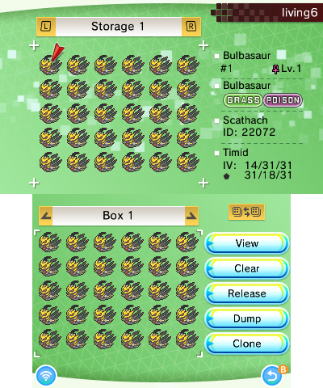

## What games are supported?
As of v10.0.0 the following games are supported
- Gen 1
  - Pokémon Red, Green
  - Pokémon Blue
  - Pokémon Yellow
- Gen 2
  - Pokémon Gold, Silver
  - Pokémon Crystal
- Gen 3
    - Pokémon Ruby, Sapphire
    - Pokémon FireRed, LeafGreen
    - Pokémon Emerald
- Gen 4
    - Pokémon Diamond, Pearl
    - Pokémon Platinum
    - Pokémon HeartGold, SoulSilver
- Gen 5
    - Pokémon Black, White
    - Pokémon Black 2, White 2
- Gen 6
    - Pokémon X, Y
    - Pokémon Omega Ruby, Alpha Sapphire
- Gen 7
    - Pokémon Sun, Moon
    - Pokémon Ultra Sun, Ultra Moon
    - Pokémon Let's Go Pikachu, Let's Go Eevee
- Gen 8
    - Pokémon Sword, Shield (v1.3 only)
        - supported DLCs: Isle of Armor, Crown Tundra

Gen 3 games work either through emulators (via [Extra Saves](./Settings#extra-saves)) or through [VC injects](./GBA-Injection) (via [custom Title IDs](./Settings#title-ids)).

LGPE saves can be sent to PKSM from Checkpoint on Switch using wireless transfer. SWSH saves can be accessed through the same transfer feature, but PKSM's support may be unstable due to SWSH version updates changing the sizes of save files.

## Is PKSM available for the Switch?
PKSM Switch development is in progress, but a large roadblock is the lack of a team UI/Asset Designer.
You can track development progress by looking at [this project board](https://github.com/FlagBrew/PKSM/projects/7). If you would like to help with the development, please go to `#pksm-switch-dev` on our Discord server.

Alternatively, for LGPE and SWSH, you can [transfer their saves wirelessly](https://github.com/FlagBrew/PKSM/wiki/Basics#loading-a-save-over-a-network) from Checkpoint on Switch. Please note that SWSH support is unstable. SWSH, BDSP, and PLA all have trouble due to variablity in the save sizes for these games. There are currently no plans for SCVI support.

## Why does PKSM require CFW? Can't you make a version that works on *hax?
PKSM has a requirement of custom firmware (CFW) for a few reasons:
- On *hax, you can only access the save archive of the game you inject into, which makes extended-memory games screwy on o3DSes. It also makes the whole pretty title screen impossible to use.
- The 3dsx has to be smaller than the `.code` of the game you're running the Homebrew Launcher for, which is a tall order for a ~10MB application like PKSM
- We have no desire to maintain separate codebases for CFW and non-CFW versions of PKSM.

## Are flash carts supported?
No, and they will **never** be supported. This is due to programming restrictions, not lack of effort.

## Why doesn't my game/save show up in PKSM?
For official VC games in non-English languages PKSM may fail to automatically recognize them. You can still point PKSM to them by [configuring their Title ID](./Settings#title-ids) through PKSM's Settings.

### Can I use PKSM on my TWiLight Menu saves?
Yes, see the [Extra Saves](./Settings#extra-saves) section of Settings for how to set it up.

### How can I get PKSM to work with my DS games installed using forwarders?
You use the same *Extra Saves* feature mentioned for TWiLight Menu saves above.

## I'm attempting to use a save that was used in an emulator at some point, and it won't load. What do I do?
There is likely an extra 122 bytes at the end of your file. You can check this by right clicking it on a computer, and checking the size (it should be `524,288 bytes`). Back the file up, then delete the last 122 bytes using [a hex editor](https://mh-nexus.de/en/hxd/).

## Does PKSM work with romhacks?
PKSM is only designed to work with the official, unmodified games. If the romhack does not alter the standard save format then PKSM *might* work with saves from it. We will not be adding support for any romhacks.

## Can I transfer mons from PKSM directly to Bank or Home?
No. This would require direct interaction with Nintendo's servers, which would doubtlessly end in a Cease & Desist against PKSM (and possibly all of FlagBrew's other projects), which would then lead to the death of PKSM.

## Will you add support for the Virtual Console games?
As of v10.0.0 PKSM supports all official VC Generation 1 and 2 titles as well as [VC injects](./GBA-Injection) of the Generation 3 games.

## How can I check and legalize my pokemon?
The info outlined in this entry is the majority of legality help we will provide here. Please do your own research using resources like [Serebii](https://serebii.net/), [Bulbapedia](https://bulbapedia.bulbagarden.net/wiki/Main_Page), or the [ProjectPokemon forums](https://projectpokemon.org/) or [Discord server](https://discord.gg/66PzPgD) instead.

> Please note: All of these functions require an internet connection of some kind.

### How do I check if my pokemon is legal?
While editing a Pokémon, go to the **Misc** screen and then either click on the *wireless icon* or press `Y`. You will then be shown a legality report describing if your Pokémon is legal, or what problems exist with it.

### How do I fix legality issues?
Once you're on the legality report screen, click the button in the bottom left. The server will then attempt to legalize your Pokémon. This is not a guarantee, and requires a few properties to be legal already. If there's an illegal combination of the below properties, the server will not be able to legalize your Pokémon.

- Ability
- Item
- Level
- Moves
- Nature
- Shininess

## Why doesn't scanning this QR work?
It depends on the type of QR you're trying to scan:
- **GPSS**: QRs from the [GPSS](https://flagbrew.org/gpss) (or the `#gpss-logs` channel of FlagBrew's Discord server) have to be scanned in the GPSS section of PKSM. This can be accessed by opening `Storage`, then selecting the wifi button on the bottom screen, then pressing `X`.
- **PKX/PB7**: Usually coming from PKHeX, these QR codes *must* be of the same generation as the currently loaded save. This scanner is accessed by opening `Editor`, then pressing `L + R`. *Please note*: QRs of PK7 files are very finicky due to their size, and as such may need multiple tries.
- **Wonder Card**: These are scanned by opening `Events`, then pressing `L + R`.

## Why doesn't ServePKX work? How can I send pokemon to PKSM from my PC now?
ServePKX has been deprecated as of PKSM v6. There are three ways you can send Pokémon to PKSM from PC now.
1. (*Recommended*) Upload the Pokémon to the GPSS using either through our Discord bot's `.gpsspost` command (should only be used in `#bot-channel`), or through architdate's [Auto Legality Plugin](https://github.com/architdate/PKHeX-Plugins) for PKHeX.
2. Create a QR code from the pkx file using PKHeX. Then, scan the QR code by opening `Editor` and pressing `L + R`.
3. Place the pkx files you want to add at `/3ds/PKSM/inject/` and run the universal `injector.c` script.

## An event is missing from the database. Can you add it?
First off, PKSM's Event section does not currently support Generation 3, LGPE, or SWSH.

If you're asking about another event, it is most likely already in the [collection](https://github.com/projectpokemon/EventsGallery) that is the source of our database. If you find the event there but not in PKSM, please [report it](https://github.com/FlagBrew/PKSM/issues) so we can update our bundling script.

## How do I use Generation 3 wondercards?
Generation 3 events do not exist as wondercards, outside of the unsupported (fake) WC3 format. There are two different methods for accessing Generation 3 events, depending on what they require.
1. For any events that directly give you a Pokémon, you will want to use the universal `injector.c` script by putting the `.pk3` file, found from [EventsGallery](https://github.com/ProjectPokemon/EventsGallery), at `/3ds/PKSM/inject/` and then running the script.
2. For events that give you an item so you can get a Pokémon (ex the Old Sea Map), you'll want to use the `RSEFrLg - Inject Tickets.c` found in the Universal scripts list.

## All the sprites in PKSM are messed up. What went wrong?
Nothing has gone wrong. I repeat -- **THIS IS *NOT* A BUG!** This is entirely expected under the right circumstances, and given the right amount of time this will go away on its own. If you're impatient, the cause is really simple and you can change *something* to return things to normal.

We've had various reactions to this once users have learned the cause:
- some facepalm, mostly because they're disappointed in themselves for not seeing it sooner
- some are relieved that it's not a bug
- some just wanting things to go back to normal so they can return to using PKSM the way they're used to
- some are indifferent
- some have even appreciated it as clever

## How do I add custom music?
Place your custom music tracks in MP3 format in `/3ds/PKSM/songs`. Relatively small file sizes are recommended, as are sampling frequency of 44100Hz and a bitrate of 96kbps.

These are recommendations, not constraints; you can generally toss whatever you want in MP3 format in there and PKSM will do fairly well.

## What backup folder corresponds to which game?
For DS and 3DS games (Generations 4 through 7), this table summarizes which backup folder for both PKSM and Checkpoint is for which game.

| Game           | PKSM      | Checkpoint                     |
| -------------- | --------- | ------------------------------ |
| Diamond        | ADAX      | ADAX POKEMON D                 |
| Pearl          | APAX      | APAX POKEMON P                 |
| Platinum       | CPUX      | CPUX POKEMON PL                |
| HeartGold      | IPKX      | IPKX POKEMON HG                |
| SoulSilver     | IPGX      | IPGX POKEMON SS                |
| Black          | IRBX      | IRBX POKEMON B                 |
| White          | IRAX      | IRAX POKEMON W                 |
| Black 2        | IREX      | IREX POKEMON B2                |
| White 2        | IRDX      | IRDX POKEMON W2                |
| X              | 0x0055D   | 0x0055D Pokémon X              |
| Y              | 0x0055E   | 0x0055E Pokémon Y              |
| Omega Ruby     | 0x011C4   | 0x011C4 Pokémon Omega Ruby     |
| Alpha Sapphire | 0x011C5   | 0x011C5 Pokémon Alpha Sapphire |
| Sun            | 0x01648   | 0x01648 Pokémon Sun            |
| Moon           | 0x0175E   | 0x0175E Pokémon Moon           |
| Ultra Sun      | 0x01B50   | 0x01B50 Pokémon Ultra Sun      |
| Ultra Moon     | 0x01B51   | 0x01B51 Pokémon Ultra Moon     |

where `X` for DS games (Diamond/Pearl through Black 2/White 2) is one of `E`, `S`, `K`, `J`, `I`, `D`, `F`, or `O`.

Recovery copies created after a failed wireless send are stored in `/3ds/PKSM/backups/wireless`.

For titles configured through the `Title IDs` option in Settings, it is based on the title ID you configured for the game. This is better explained with an example:

Let's say for "FireRed" you've configured the ID `0xABCDEFGHIJKLMNOP`. To get the backup folder name

1. remove the last 2 digits
    - in our example, this is `OP`, which would leave us with `0xABCDEFGHIJKLMN`
2. take the last 5 digits
    - our example would leave us with `JKLMN`
3. add `0x` in front of those 5 digits
    - our example gives us with `0xJKLMN`

And that's it! So our backup folder for "FireRed" with the title ID `0xABCDEFGHIJKLMNOP` will be `0xJKLMN`.

> If you set up any Generation 3 save files as Extra Saves *without* configuring a Title ID, the backups will be in a particular folder based on the game
>
> | Game      | PKSM    |
> | --------- | ------- |
> | Ruby      | 0x00001 |
> | Sapphire  | 0x00002 |
> | Emerald   | 0x00003 |
> | FireRed   | 0x00004 |
> | LeafGreen | 0x00005 |

## It says I need to enter an API Url, what's that and where do I get it?
As of PKSM 10.1.2, the cloud services for PKSM were discontinued, to continue being able to use stuff like GPSS and Auto Legality, you need to run your own instance of it. To get started follow [this guide](https://github.com/FlagBrew/local-gpss/wiki/Server-Setup-Guide)
