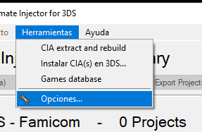
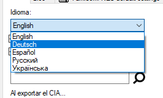
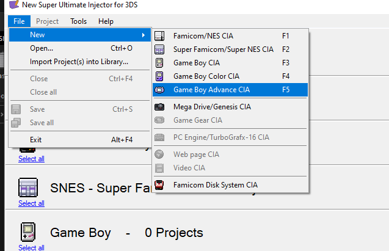
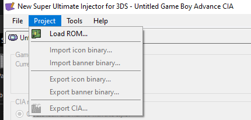
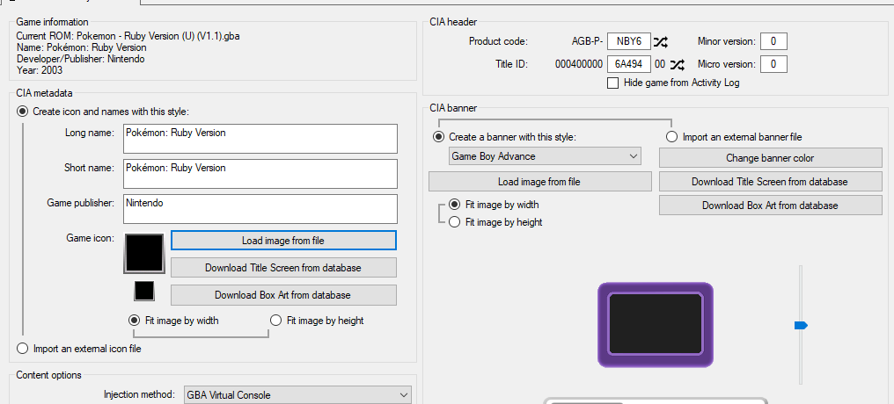
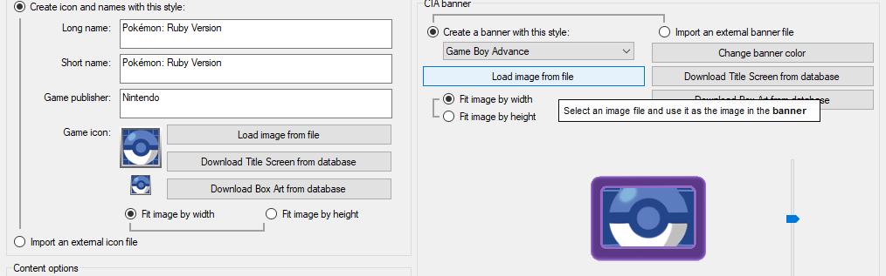
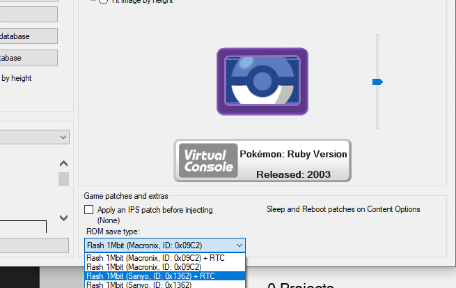
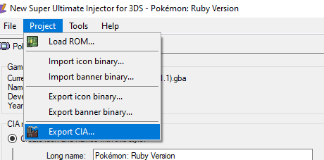
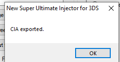
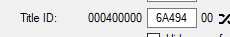

For creating Virtual Console injections of GBA games that are compatible with PKSM, you need to follow certain steps while making the CIA. The most important step is to choose a save type of 1Mbit.

## Requirements
You will need the following:

- [New Super Ultimate Injector (NSUI)](https://gbatemp.net/threads/discussion-new-super-ultimate-injector-nsui.500376/)
- your Gen 3 ROM
- PKSM v9.0.0 or above (preferably the [latest version](https://github.com/FlagBrew/PKSM/releases/latest))

> ### Changing NSUI's Language
> NSUI might be in Spanish the first time you run it. To fix this:
>
> 1. Open the `Herramientas` menu and select `Opciones...`
> 

> 2. From the drop-down under `Idioma` choose your desired language
> 

>
> This guide walks you through using NSUI to build your inject in English so you might see different messages if you use another language.

## Building Your CIA
Once you have the above requirements, just follow the instructions below to build your GBA VC inject

1. From NSUI's menu bar, select `File` > `New` > `Game Boy Advance CIA`

2. Load your ROM by going back to the menu bar and selecting `Project` > `Load ROM...`

NSUI should automatically fill the inputs with your ROM's info.

If it cannot find a title screen or box art from the database then you will need to click the buttons to load them from a file. Here's an example (using PKSM's icon instead of a game's)

3. Underneath the preview, open the `ROM save type` drop-down and choose an appropriate save type
- For **Ruby**, **Sapphire**, and **Emerald** you need to choose a `1Mbit + RTC` save type
- For **FireRed** and **LeafGreen** you just need to choose a `1Mbit` save type

> ### Sanyo or Macronix
> [Some sources](https://www.reddit.com/r/PokemonROMhacks/comments/8hzm3e/glazed_fix_saving_in_3ds_vc_injection/dyrymr9) recommend you choose Sanyo while others say it doesn't matter. Use whichever, as long as the save type is 1Mbit + RTC

4. Export the CIA with `Project` > `Export CIA...`

If you've done everything correctly, you should see this message dialog

Make note of the Title ID (yours will be different) of the generated CIA as you will need it later to configure your GBA title in PKSM.

At this point, all that's left to do is move the newly made CIA to your 3DS and install it via FBI. Once it is installed, open the game and make a save (might want to get your first Pokémon too). Then you can configure your GBA game in PKSM's [Settings](./Settings#title-id) using the Title ID mentioned above and edit your save like normal.
