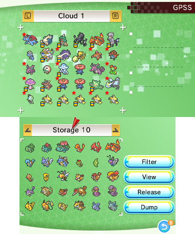
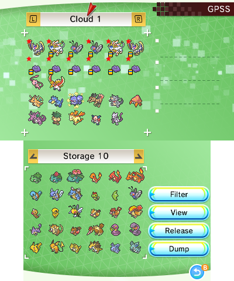

> [!IMPORTANT]  
> Cloud GPSS is now discontinued, you will need to run local-gpss to use GPSS, see the [guide here](https://github.com/FlagBrew/local-gpss/wiki/Server-Setup-Guide)

Back in v7.0.0 we introduced a new feature -- the **Global PKSM Sharing Service**, or **GPSS**. It's an online service where users can upload their Pokémon to share with others or browse the shared Pokémon for something they'd like to download.

Some notes about the GPSS:
- Any valid Pokémon can be uploaded to the GPSS
- Anyone is allowed to upload any Pokémon they want to it
- Anyone is allowed to download any Pokémon they want from it
- All Pokémon uploaded are run through PKHeX's legality check and their result (legal or illegal) is noted in their details
- Once a month, all Pokémon on the GPSS have their recent download count checked. If it is 0, it gets removed.

## PKSM
> Using PKSM to browse the GPSS requires an active internet connection for your 3DS.

To access the GPSS, go into Storage and tap the wireless button in the bottom-left of the touch screen. The screen will update to show your loaded bank on the bottom screen and a new set of boxes on the top screen labelled `Cloud`. The contents of the Cloud boxes will be the currently available uploads on the GPSS, sorted by upload time from newest to oldest.

The buttons on the right side of the touch screen shouldn't need much explanation--they have pretty much the same functions as their counterparts in [Storage](./Storage.md):

- **Filter**: greys out sprites that don't match your selected filter(s)
- **View**: shows details on the top screen of the Pokémon under the cursor
- **Release**: deletes the Pokémon under the cursor if it is hovering over a filled bank slot
- **Dump**: dumps the Pokémon under the cursor to a `pkx` file on your SD card if it is hovering over a filled bank slot

Uploading is simple: grab a Pokémon from your bank on the bottom screen, place it into any slot on the top screen (even one that already has a Pokémon in it) and confirm that you want to share it.

Downloading a Pokémon from the GPSS is just as easy: just hover the cursor over the one that you want, press `A` to pick it up, confirm that you want to download it, and place it into an open slot in your bank on the bottom screen.

You can also download from the GPSS with a special download or QR code. Placing the cursor over a Cloud box slot and pressing `X` will bring up a prompt asking if you want to enter a share code. Agreeing will bring up a number pad input where you can input the 10-digit download code or press the `QR Scanner` button to activate the camera so you can scan a GPSS QR code.

You can also filter and/or sort what you see in the Cloud boxes by using the options in the menu that pops up when you press `Start`:

- **Latest** / **Popular**: changes the order of the Cloud boxes to either be by time of upload (Latest) or by number of downloads (Popular)
- **Ascending** / **Descending**: reverses the order of the above sort
- **Any** / **Legal**: filters the Cloud boxes to contain all uploads or only those that passed the legality check

### GPSS Groups
PKSM also allows uploading and downloading groups of Pokémon. You can view the groups that have been uploaded by pressing `Y`.

Uploading a group works similarly to a single Pokémon, except that the confirmation prompt pops up after choosing a 6th Pokémon instead of after the first. You can upload a smaller group (of 2 to 5) by pressing `X` when you're done selecting Pokémon.

Downloading works only slightly differently. When you confirm that you want to download, the group will be copied and picked up by the cursor to await placement in your bank boxes. You will have to place each Pokémon from the group separately.

## Alternative Ways of Accessing the GPSS
Aside from PKSM, there are 3 other primary ways of interacting with the GPSS: our **Discord server**, our **website**, and **PKHeX's Auto-Legality Plugin**. Each option has its own pros and cons in the form of features it does not share with the other methods.

### Feature Comparison
Each method of accessing the GPSS has its pros and cons in the form of features it is or is not capable of performing.

| Feature           | PKSM | Discord | Website | PKHeX Plugin |
| ----------------- | ---- | ------- | ------- | ------------ |
| Upload (Single)   | yes  | yes     | no      | yes          |
| Download (Single) | yes  | yes     | yes     | yes          |
| Browse (Single)   | yes  | yes     | yes     | no           |
| Upload (Group)    | yes  | no      | no      | ?            |
| Download (Group)  | yes  | no      | yes     | ?            |
| Browse (Group)    | yes  | no      | yes     | no           |
| Filters           | no   | no      | yes     | ?            |

### Discord
The [FlagBrew Discord server](https://discord.gg/bGKEyfY) has a channel dedicated to the GPSS - `#gpss-logs`. Every time someone uploads something to the GPSS, a bot creates a post containing its details. The channel is a way to see practically everything ever uploaded to the GPSS.

> **NOTE**: Not everything in `#gpss-logs` can be downloaded. A number of Pokémon mentioned in there have been removed from the GPSS, usually due to not having enough recent downloads.

<!-- TODO: screenshot - #gpss-logs post -->

As you can see in the screenshot above, the bot provides a lot of details about each upload. Most of the info is fairly obvious, but a few things might not be:

- The `New GPSS Pokemon Shared!` at the top is a direct link to the upload details view on our website (see below for more info)
- The color of the bar along the left side of the post represents the result of the legality check: green means it's legal, red means it's illegal
- The QR code is for scanning with the GPSS mode QR scanner in PKSM to quickly find and download a specific Pokémon
- The download code (in small text below the QR) is an alternate way to quickly download the specific Pokémon

Aside from viewing the history of uploads in `#gpss-logs`, you can also upload to and download from the GPSS using certain bot commands in `#bot-channel`.

> **Warning:** Failure to keep the usage of these bot commands in `#bot-channel` will result in a moderator taking action.

To upload something new to the GPSS with the bot, just use `.gpsspost` with a `.pkx` file, either uploaded as an attachment to the post or as a direct download link (such as a Google Drive link).

<!-- TODO: `.gpssfetch` -->

### Website
On the [GPSS page](https://flagbrew.org/gpss) of our website, you can browse the full list of what is currently on the GPSS. Near the top of the page you'll find a set of filters

<!-- TODO: screenshot - main list -->

- **Search**: input part or all of an OT name, species, nickname, or download code and the results will be filtered down to only those uploads that match
- **Minimum Generation** and **Maximum Generation**: Only Pokémon that are from these generations or in between will be included in the list
- **Show LGPE Generation**: When selected, Pokémon that came from Let's Go Pikachu/Eevee will be included in the list
- **Show Legal Pokémon Only**: When selected, only Pokémon that pass the legality checker we use will be included in the list

Just above the filters are 3 buttons that let you sort the listed Pokémon by **Latest** (when they were uploaded) or **Popular** (how many downloads they have), either ascending or descending. You can also choose to sort by **Legality**, with either all the Legal (ascending) or Illegal (descending) ones first.

The main portion of the page is made up of the list of current uploads in the form of summary boxes containing the following:

- **Stars icon**: Signifies that the Pokémon is shiny. Won't appear on all uploads.
- **Egg icon**: Signifies that the Pokémon is still an egg. Won't appear on all uploads.
- **Species name**
- **Gender symbol**
- **Sprite**: Due to a lack of assets, anything from Generation 8 will have a blank sprite
- **Name**: The Pokémon's current nickname
- **Level**
- **OT**: Original Trainer's name
- **OT TID**
- **Download code**: can be input into PKSM to quickly find a specific upload
- **Downloads**: downloads since upload or the last monthly check
- **Lifetime Downloads**: total downloads since the Pokémon was uploaded, which can be higher than *Downloads* if it has been up for more than 1 month
- **QR button**: clicking this blue button will reveal a QR code that can be scanned with PKSM to easily download a specific uploaded Pokémon
- **Download button**: clicking this will download the Pokémon's `.pkx` file to your device

By clicking on the species name at the top of a Pokémon's summary box, you can bring up the details page for it, where you can see extra info like its stats and moves. For Pokémon that are recognized as illegal, this page even has a button to reveal the list of reasons why it failed the legality check.

<!-- TODO: screenshot - details page -->

> **NOTE**: There is currently no way to upload anything to the GPSS from flagbrew.org.

### Auto-Legality Plugin
The [Auto-Legality plugin](https://github.com/architdate/PKHeX-Plugins/releases) for [PKHeX](https://projectpokemon.org/home/files/file/1-pkhex/) also has support for uploading and downloading from the GPSS.

<!-- * TODO: write-up

> - *no* browsing
> - *no* detailed view
> - *no* legality analysis (until downloaded or viewed via other method) -->
