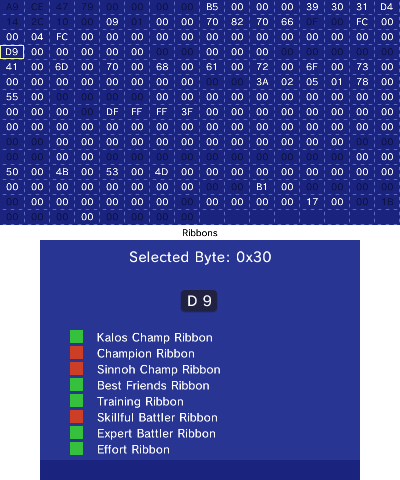
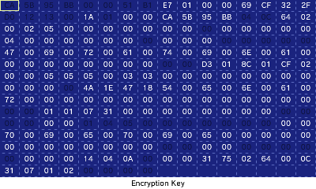
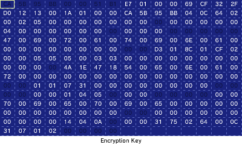
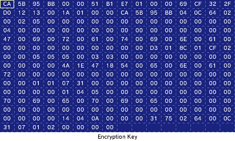

The Hex Editor is an incredibly powerful, and potentially intimidating, tool PKSM provides you for editing your Pokémon. It can be accessed by tapping the block of purple letters in the upper-right corner when editing a Pokémon in the [Editor](./Editor). When you first open it, you'll be greeted by a screen that looks completely different from the other Editor screens you've seen so far.

The top screen shows the Pokémon you're editing in raw hex. The byte that is currently selected has a box around it, and it's purpose is briefly described at the bottom of the screen. If a byte is grayed out/disabled, you will need to unlock it before you can change it.

The bottom screen shows the index of the currently selected byte, it's value, and sometimes a translation of the value into a more understandable version (like the Species bytes). For bytes that are unlocked, there are also editing controls in the form of plus buttons above and minus buttons below the value of the byte and/or labeled boxes for toggling flags kept in that byte.

> There is a learning curve to using the hex editor. You will need to be able to convert values between decimal and hexadecimal (you can easily find a tool to help with this online). For those fields that don't show as a number in-game, you will also need to find some kind of reference for what values mean.

The controls are pretty simple: navigation is done with the d-pad or circle pad and edits can be made with `A` (increase byte's value), `X` (decrease byte's value), or the touch screen.

## Hex Editor Exclusives
While PKSM's normal editor screens allow you to change many of the details of your Pokémon, there are some things that don't appear on them. In order to edit those you will *need* to go into the hex editor and find the appropriate byte(s). The tables below list all of the exclusive fields for each of the supported formats that you can edit. **Lock Lv.** represents how many times the hex editor needs to be unlocked in order to edit the field's value.

> For fields that span multiple bytes, be aware that Pokémon stores data in *little-endian* format.

Generations 1 and 2 (RGBY and GSC)

| Value                            | Lock Lv. |      Gen 1 |      Gen 2 |
| -------------------------------- | :------: | ---------: | ---------: |
| PK1/PK2 Header - Count           |    2     |       0x00 |       0x00 |
| PK1/PK2 Header - Display Species |    2     |       0x01 |       0x01 |
| PK1/PK2 Header - Terminator      |    2     |       0x02 |       0x02 |
| Current HP                       |    0     | 0x04..0x05 | 0x25..0x26 |
| PC Level                         |    0     |       0x06 |            |
| Status Conditions                |    0     |       0x07 |       0x23 |
| Type 1                           |    2     |       0x08 |            |
| Type 2                           |    2     |       0x09 |            |
| Catch Rate                       |    0     |       0x0A |            |
| Trainer ID                       |    0     | 0x0F..0x10 | 0x09..0x0A |
| Experience                       |    0     | 0x11..0x13 | 0x0B..0x0D |
| Move 1 Current PP                |    0     |       0x20 |       0x1A |
| Move 2 Current PP                |    0     |       0x21 |       0x1B |
| Move 3 Current PP                |    0     |       0x22 |       0x1C |
| Move 4 Current PP                |    0     |       0x23 |       0x1D |
| Max HP                           |    1     | 0x25..0x26 | 0x27..0x28 |
| Attack                           |    1     | 0x27..0x28 | 0x29..0x2A |
| Defense                          |    1     | 0x29..0x2A | 0x2B..0x2C |
| Speed                            |    1     | 0x2B..0x2C | 0x2D..0x2E |
| Special                          |    1     | 0x2D..0x2E |            |
| Caught Data                      |    0     |            | 0x20..0x21 |
| Special Attack                   |    1     |            | 0x2F..0x30 |
| Special Defense                  |    1     |            | 0x31..0x32 |

Generations 3 though 7 (RS through USUM)

| Value                   | Lock Lv. |     Gen 3 |                               Gen 4 |                               Gen 5 |                   Gen 6 |                   Gen 7 |
| ----------------------- | :------: | --------: | ----------------------------------: | ----------------------------------: | ----------------------: | ----------------------: |
| PID                     |    0     | 0x00-0x03 |                           0x00-0x03 |                           0x00-0x03 |               0x18-0x1B |               0x18-0x1B |
| Original Trainer ID     |    0     | 0x04-0x05 |                           0x0C-0x0D |                           0x0C-0x0D |               0x0C-0x0D |               0x0C-0x0D |
| Original Trainer SID    |    0     | 0x06-0x07 |                           0x0E-0x0F |                           0x0E-0x0F |               0x0E-0x0F |               0x0E-0x0F |
| Language                |    0     |      0x12 |                                0x17 |                                0x17 |                    0xE3 |                    0xE3 |
| Bad Egg flag            |    1     |      0x13 |                                     |                                     |                         |                         |
| Species available flag  |    1     |      0x13 |                                     |                                     |                         |                         |
| markings                |    0     |      0x1B |                                0x16 |                                0x16 |                    0x2A |               0x16-0x17 |
| Sanity Placeholder      |    2     | 0x1E-0x1F |                                     |                                     |               0x04-0x05 |               0x04-0x05 |
| Checksum                |    2     | 0x1C-0x1D |                           0x06-0x07 |                           0x06-0x07 |               0x06-0x07 |               0x06-0x07 |
| Experience              |    0     | 0x24-0x27 |                           0x10-0x13 |                           0x10-0x13 |               0x10-0x13 |               0x10-0x13 |
| move PP Ups             |    0     |      0x28 |                           0x34-0x37 |                           0x34-0x37 |               0x66-0x69 |               0x66-0x69 |
| move current PP         |    0     | 0x34-0x37 |                           0x30-0x33 |                           0x30-0x33 |               0x62-0x65 |               0x62-0x65 |
| Contest stats           |    0     | 0x3E-0x43 |                           0x1E-0x23 |                           0x1E-0x23 |               0x24-0x29 |               0x24-0x29 |
| OT gender               |    0     |      0x47 |                                0x84 |                                0x84 |                    0xDD |                    0xDD |
| "is egg" flag           |    0     |      0x4B |                                0x3B |                                0x3B |                    0x77 |                    0x77 |
| Ribbons                 |    0     | 0x4C-0x4F | 0x24-0x27 0x3C-0x3F 0x60-0x63 | 0x24-0x27 0x3C-0x3F 0x60-0x63 |  0x30-0x36 0x38-0x39 |  0x30-0x36 0x38-0x39 |
| Fateful encounter flag  |    0     |      0x4F |                                0x40 |                                0x40 |                    0x1D |                    0x1D |
| Status Conditions       |    0     | 0x50-0x53 |                                0x88 |                                0x88 |               0xE8-0xEB |               0xE8-0xEB |
| Level                   |    0     |      0x54 |                                0x8C |                                0x8C |                    0xEC |                    0xEC |
| Mail ID                 |    1     |      0x55 |                                     |                                     |                         |                         |
| Current HP              |    1     | 0x56-0x57 |                           0x8E-0x8F |                           0x8E-0x8F |               0xF0-0xF1 |               0xF0-0xF1 |
| Max HP                  |    1     | 0x58-0x59 |                           0x90-0x91 |                           0x90-0x91 |               0xF2-0xF3 |               0xF2-0xF3 |
| Attack                  |    1     | 0x5A-0x5B |                           0x92-0x93 |                           0x92-0x93 |               0xF4-0xF5 |               0xF4-0xF5 |
| Defense                 |    1     | 0x5C-0x5D |                           0x94-0x95 |                           0x94-0x95 |               0xF6-0xF7 |               0xF6-0xF7 |
| Speed                   |    1     | 0x5E-0x5F |                           0x96-0x97 |                           0x96-0x97 |               0xF8-0xF9 |               0xF8-0xF9 |
| Sp. Attack              |    1     | 0x60-0x61 |                           0x98-0x99 |                           0x98-0x99 |               0xFA-0xFB |               0xFA-0xFB |
| Sp. Defense             |    1     | 0x62-0x63 |                           0x9A-0x9B |                           0x9A-0x9B |               0xFC-0xFD |               0xFC-0xFD |
| Ability                 |    0     |           |                                0x15 |                                0x15 |                    0x14 |                    0x14 |
| Shiny leaves (HGSS)     |    0     |           |                                0x41 |                                     |                         |                         |
| Egg location (Platinum) |    0     |           |                           0x44-0x45 |                                     |                         |                         |
| Met location (Platinum) |    0     |           |                           0x46-0x47 |                                     |                         |                         |
| Encounter type (G4)     |    0     |           |                                0x85 |                                0x85 |                    0xDE |                         |
| HGSS Poké Ball          |    0     |           |                                0x86 |                                0x86 |                         |                         |
| Capsule Index (seals)   |    1     |           |                                0x8D |                                0x8D |                         |                         |
| Mail message + OT Name  |    1     |           |                           0x9C-0xD3 |                           0x9C-0xD3 |                         |                         |
| Seal Coordinates        |    1     |           |                           0xD4-0xEB |                                     |                         |                         |
| N's Pokémon             |    0     |           |                                     |                                0x42 |                         |                         |
| Encryption Key          |    2     |           |                                     |                                     |               0x00-0x03 |               0x00-0x03 |
| Ability number          |    1     |           |                                     |                                     |                    0x15 |                    0x15 |
| Training bag hits left  |    0     |           |                                     |                                     |               0x16-0x17 |                         |
| Super Training flags    |    0     |           |                                     |                                     | 0x2C-0x2F 0x3A, 0x72 | 0x2C-0x2F 0x3A, 0x72 |
| Current Trainer Name    |    0     |           |                                     |                                     |               0x78-0x8F |               0x78-0x8F |
| CT gender               |    0     |           |                                     |                                     |                    0x92 |                    0x92 |
| Current Handler         |    0     |           |                                     |                                     |                    0x93 |                    0x93 |
| Geolocation             |    0     |           |                                     |                                     |               0x94-0x9D |               0x94-0x9D |
| CT Friendship           |    0     |           |                                     |                                     |                    0xA2 |                    0xA2 |
| CT Memories (G6+)       |    1     |           |                                     |                                     |  0xA4-0xA6 0xA8-0xA9 |  0xA4-0xA6 0xA8-0xA9 |
| OT Friendship           |    0     |           |                                     |                                     |                    0xCA |                    0xCA |
| OT Memories (G6+)       |    1     |           |                                     |                                     |               0xCC-0xD0 |               0xCC-0xD0 |
| country ID              |    0     |           |                                     |                                     |                    0xE0 |                    0xE0 |
| region ID               |    0     |           |                                     |                                     |                    0xE1 |                    0xE1 |
| 3DS region ID           |    0     |           |                                     |                                     |                    0xE2 |                    0xE2 |
| Hyper Training          |    0     |           |                                     |                                     |                         |                    0xDE |
| Dirt Type               |    1     |           |                                     |                                     |                         |                    0xED |
| Dirt Location           |    1     |           |                                     |                                     |                         |                    0xEE |

Switch Games (LGPE and SwSh)

| Value                       | Lock Lv. |                   LGPE |                       SwSh |
| --------------------------- | :------: | ---------------------: | -------------------------: |
| Encryption Key              |    2     |              0x00-0x03 |                  0x00-0x03 |
| Sanity Placeholder          |    2     |              0x04-0x05 |                  0x04-0x05 |
| Checksum                    |    2     |              0x06-0x07 |                  0x06-0x07 |
| Original Trainer ID         |    0     |              0x0C-0x0D |                  0x0C-0x0D |
| Original Trainer SID        |    0     |              0x0E-0x0F |                  0x0E-0x0F |
| Experience                  |    0     |              0x10-0x13 |                  0x10-0x13 |
| Ability                     |    0     |                   0x14 |                  0x14-0x15 |
| Ability number              |    1     |                   0x15 |                       0x16 |
| Markings                    |    0     |              0x16-0x17 |                  0x18-0x19 |
| PID                         |    0     |              0x18-0x1B |                  0x1C-0x1F |
| Fateful encounter flag      |    0     |                   0x1D |                       0x22 |
| Awakened Stats              |    0     |              0x24-0x29 |                            |
| HEIGHT_ABSOLUTE             |    1     |              0x2C-0x2F |                            |
| Ribbons                     |    0     |              0x30-0x36 |                  0x33-0x3B |
| HEIGHT                      |    0     |                   0x3A |                       0x50 |
| WEIGHT                      |    0     |                   0x3B |                       0x51 |
| move current PP             |    0     |              0x62-0x65 |                  0x7A-0x7D |
| move PP Ups                 |    0     |              0x66-0x69 |                  0x7E-0x81 |
| "is egg" flag               |    0     |                   0x77 |                       0x8F |
| Current Trainer Name        |    0     |              0x78-0x8F |                  0xA8-0xBF |
| CT gender                   |    0     |                   0x92 |                       0xC2 |
| Current Handler             |    0     |                   0x93 |                       0xC4 |
| Geolocation                 |    0     |              0x94-0x9D |                            |
| CT Friendship               |    0     |                   0xA2 |                       0xC8 |
| CT Memories (G6+)           |    1     | 0xA4-0xA6 0xA8-0xA9 |                  0xC9-0xCD |
| OT Friendship               |    0     |                   0xCA |                      0x112 |
| OT Memories (G6+)           |    1     |              0xCC-0xD0 | 0x113-0x114 0x116-0x118 |
| OT gender                   |    0     |                   0xDD |                      0x125 |
| Hyper Training              |    0     |                   0xDE |                      0x126 |
| Country ID                  |    0     |                   0xE0 |                            |
| Region ID                   |    0     |                   0xE1 |                            |
| 3DS region ID               |    0     |                   0xE2 |                            |
| Language                    |    0     |                   0xE3 |                       0xE2 |
| Status Conditions           |    0     |              0xE8-0xEB |                  0x94-0x97 |
| Level                       |    0     |                   0xEC |                      0x148 |
| Dirt Type                   |    1     |                   0xED |                            |
| Dirt Location               |    1     |                   0xEE |                            |
| Current HP                  |    1     |              0xF0-0xF1 |                  0x8A-0x8B |
| Max HP                      |    1     |              0xF2-0xF3 |                0x14A-0x14B |
| Attack                      |    1     |              0xF4-0xF5 |                0x14C-0x14D |
| Defense                     |    1     |              0xF6-0xF7 |                0x14E-0x14F |
| Speed                       |    1     |              0xF8-0xF9 |                0x150-0x151 |
| Sp. Attack                  |    1     |              0xFA-0xFB |                0x152-0x153 |
| Sp. Defense                 |    1     |              0xFC-0xFD |                0x154-0x155 |
| CP                          |    1     |              0xFE-0xFF |                            |
| Favorite                    |    0     |                        |                       0x16 |
| Gigantamax Factor           |    0     |                        |                       0x16 |
| Original Nature             |    0     |                        |                       0x20 |
| Contest stats               |    0     |                        |                  0x2C-0x31 |
| Battle Memory Ribbon count  |    0     |                        |                       0x3C |
| Contest Memory Ribbon count |    0     |                        |                       0x3D |
| Marks                       |    0     |                        |                  0x40-0x44 |
| Dynamax Level               |    0     |                        |                       0x90 |
| Current Trainer Language    |    0     |                        |                       0xC3 |
| Current Trainer ID          |    0     |                        |                  0xC6-0xC7 |
| Battle Version              |    0     |                        |                       0xDF |
| Form Argument               |    0     |                        |                  0xE4-0xE7 |
| Favorite Ribbon             |    0     |                        |                       0xE8 |
| TR Record flags             |    0     |                        |                0x127-0x134 |
| Home Tracker                |    1     |                        |                0x135-0x13C |
| Dynamax Type                |    1     |                        |                0x156-0x157 |

## Advanced Hex Editor
> You may see this called different names at times, such as:
> - God mode
> - Easter Egg mode
> - super hex editor

Bytes that are **locked** (greyed out) are like that for a reason: it is usually far more dangerous to edit them compared to unlocked bytes, *especially* if you don't know what values are legal for the particular byte.

It is possible to unlock them (see screenshots below), but you will **not** be told *how* to unlock them. If you really want to know how, we insist you figure it out yourself and direct you to read through PKSM's code.

