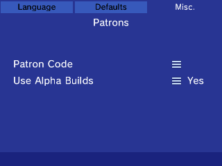

Here you will find documentation on all Patron-exclusive features of PKSM.

## How To
To enjoy any of the features below you first have to do three things:

1. Join [FlagBrew's Discord server](https://discord.gg/bGKEyfY)
2. On Patreon, become a Patron of either [FlagBrew](https://www.patreon.com/FlagBrew) or [Bernardo](https://www.patreon.com/bernardogiordano)
3. Make sure your Patreon account is linked to your Discord account: https://support.patreon.com/hc/en-us/articles/212052266-Get-my-Discord-role

Once you've fulfilled those conditions, you will be given access to channels of the server and features of PKSM that are exclusive to Patrons. Also, FlagBot will try to PM you your *Patron token* -- your secret, personal key for unlocking the special Patrons-only features in PKSM.

Below you'll find explanations of the benefits you'll receive from supporting FlagBrew.

## Discord
Our server has a few channels open only to Patrons, but when it comes to PKSM, the important ones are:

- `#patrons-chat` - This is the general chat for Patrons. Usually this is used to report bugs in early builds or discuss potential new features.
- `#patrons` - Basically an announcements channel specifically for Patrons. This is where FlagBrew Team members will post important information, like warnings about changes in nightly builds.
- `#votes` - When a new feature, or change to an existing one, comes up that would benefit from user input, those that joined FlagBrew's Patreon at the **Decision Maker** level will be able to voice their opinion here.

## PKSM
To use the Patron token mentioned earlier, open PKSM's Settings and tap the four corners of the touch screen. The screen should change to look like the following (the highlighted tab may be different):

**Patron Code** is where you'll enter the token that FlagBot made for you. Pressing `≡` will bring up a keyboard where you can type in your token manually or press the **QR Scanner** button beneath the keyboard to scan the QR code that came in FlagBot's message.

**Use Alpha Builds**, along with **Automatically Update PKSM** (under **Misc**) and **Patron Code**, determines what PKSM checks for when looking for updates, as this table explains:

| Update PKSM | Alpha Builds | Code    | PKSM version              | Mystery Gift DB |
| :---------: | :----------: | ------- | ------------------------- | --------------- |
|     Yes     |     Yes      | valid   | newest release/nightly    | latest          |
|     Yes     |     Yes      | invalid | latest release (if newer) | latest          |
|     Yes     |      No      | any     | latest release (if newer) | latest          |
|     No      |    Yes/No    | any     | no update                 | no update       |

> ### Note About Alpha Builds
> For the most part you can safely use nightlies as you would the releases. Once in a while, though, a nightly will be made that isn't entirely stable. This is rare and will be accompanied by a post mentioning the instability, along with a ping of the *Patron* role.
>
> We only keep nightly builds that are from the last 7 days. If a nightly build is older than 7 days, and it's not the only one from that time, it gets deleted.

## Website
There's also a small reward on our website, specifically on the [GPSS page](https://flagbrew.org/gpss). Uploads from PKSM with a valid Patron code are flagged and have a glow effect applied to their summaries on the list.

<!-- * TODO: GPSS Patron upload -->
