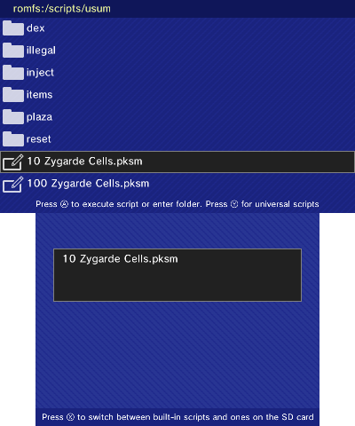

The **Scripts** menu allows you to execute scripts on your save.

You can navigate this menu by using the d-pad and when you find the script you wish to execute, press `A` to run it. A confirmation prompt will appear asking if you if you wish to execute it. Pressing `A` will execute the script, while pressing `B` wil return you to the script list.

While most of the existing PKSM scripts are automatically bundled inside the app, you can also provide your own scripts by placing them on your SD card inside of the `sdmc:/3ds/PKSM/scripts/<game>` folder. You can then access the scripts on your SD by pressing `X`.

> If you are wanting to learn how to make your own scripts, please check out the [PKSM-Scripts wiki](https://github.com/FlagBrew/PKSM-Scripts/wiki). It has the most up-to-date documentation of PKSM's picoC API.

Below are some notes and details about bundled scripts that may be useful to know that couldn't be summarized to fit in scripts' names. A full list of bundled scripts as well as some more targeted notes on them can be found [here](./Built-In-Scripts.md).

> #### Note About Reset Scripts
> USE THESE WITH CAUTION. Most of the reset scripts have been tested, but there may still be undocumented side effects.

### Universal
Pressing `Y` will bring up *universal scripts*, which are scripts that work across multiple games (sometimes all of them).

- **All TMs**: puts all available TMs into your bag. Does not give any HMs.
- **Edit Trainer Info**: allows you to edit your trainer's name, TID, SID, or TSV. Does not work on LGPE or SWSH. *WARNING:* use at your own risk - editing trainer info of a save that has been online *may* result in the save becoming banned from further online play.
- **injector**: Allows you to inject PKX and Wondercard files from `/3ds/PKSM/inject` into your save's PC.
    - **LGPE saves**: only `.pb7`, `.wb7`, and `.wb7full` files are supported.
    - **non-LGPE saves**:
        - supported PKX: `.pkx` (1-8), `.ekx` (1-8)
        - supported WC: `.pgt`, `.wc4`, `.pgf`, `.wc6`, `.wc6full`, `.wc7`, and `.wc7full`
- **living dex**: overwrites the boxes of your save, starting with Box 1, with one of every Pokémon. *NOTE:* Nothing generated by this script is guaranteed to be legal.
- **Quick hatch**: does **NOT** hatch your eggs for you -- it just makes the eggs hatch in as few steps as possible
- **Renew Wondercard**: Allows you to reclaim an already injected (and claimed) Wondercard
- **Swarm**: allows you to manipulate the currently swarming Pokémon for your Generation 4 or 5 save
    - `B2W2, BW`: The swarm you choose may not stick if the "last saved" date on your save is before the current date according to the system you next play on.
    - `B2W2, BW`: Route 8 is frozen over in Winter so you may be unable to encounter Croagunk (BW) or Quagsire (B2W2) after setting it as the active swarm.
    - `HGSS`: due to the inability to tell HG saves apart from SS saves (by their content alone), both games will see "Baltoy / Gulpin" with Baltoy's sprite and "Sableye / Mawile" with Sableye's sprite on the selection screen despite Baltoy and Sableye only appearing in HG and Gulpin and Mawile only appearing in SS

### Specific Games
These scripts appear in the `romfs:/scripts/<game>` lists, sometimes multiple.

- **Reset (pokemon)**: Allows any listed Pokémon to be re-obtained (if gift) or re-battled

#### Mass Injection
- All mass injection scripts target the first slot of Box 1 to start injecting the collection. If you're worried about losing some of your Pokémon, make sure to clear out enough of your in-game boxes to make room
    - **Colosseum**: 2 boxes
    - **XD**: 3 boxes
    - everything else: 1 box
- Not all Pokémon in the mass injection scripts may be legal
- Only the "Living Dex" scripts update your dex. If you want the contents of a mass inject script to be registered but don't want the full Fill Dex, do one of the following:
    - deposit the unregistered Pokémon in the Day Care then withdraw them
    - take them into a wild battle (reported to work but not confirmed)
- **rBreedingDitto**: the Ditto in these scripts were obtained from [this list on /r/BreedingDittos](https://www.reddit.com/r/BreedingDittos/comments/2wqabp/giveaway_so_you_want_a_ditto/). They are subject to all the conditions and limits set by /r/BreedingDittos (so don't try passing them off as legal on /r/pokemontrades)

#### Fill Dex
- Regional Pokédex scripts will overwrite anything you've seen (and owned if you use the "owned" version) which may cause you to lose registration of anything not in your game's regional Pokédex
- These scripts will fill your dex enough to unlock access to the following rewards:
    - `PT, DP` **Sinnoh seen**: regional dex diploma, National dex upgrade
    - `HGSS` **Johto owned**: regional dex diploma
    - `HGSS, PT, DP` **National owned**: national dex diploma
    - `BW` **Unova owned**: regional dex diploma
    - `BW` **National owned**: national dex diploma
    - `B2W2` **Unova seen**: Permit (for visiting Nature Preserve)
    - `B2W2` **Unova owned**: regional dex diploma, Oval Charm
    - `B2W2` **National owned**: national dex diploma, Shiny Charm
    - `XY` **Kalos seen**: Oval Charm
    - `XY` **Kalos owned**: regional dex diplomas (Central, Coastal, Mountain, Kalos)
    - `ORAS` **Hoenn seen**: Oval Charm
    - `ORAS` **Hoenn owned**: regional dex diploma
    - `ORAS, XY` **National owned**: national dex diploma, Shiny Charm
    - `USUM, SM` **Alola owned**: Shiny Charm
- **National** versions will also unlock access to all corresponding regional rewards
- **Owned** versions will also unlock access to all corresponding **seen** rewards
- **Complete** versions will unlock all the same rewards as the **National owned** versions
- Only the **Complete** versions will fill in Mythicals (Mew, Celebi, Jirachi, etc.)
- Only the **Complete (illegal)** versions will unlock *all* forms and shiny sprites, including unreleased ones

#### Battle Facility
- `all games` **Streak**: sets the current streak to just before a battle with the facility's leader
- `all games` **Use party**: Allows you to use the members of your party, starting from the first.
    - ***Legality Warning***: This can let you smuggle in otherwise banned species (such as mascot legends)
- `B2W2, BW, HGSS, PT, DP` **Skip to Last Battle**: Only effective if you quicksave. Lets you can skip straight to the 7th battle in the set
    - `HGSS, PT` **Battle F-A-C**: F = Factory, A = Arcade, C = Castle
- `PT, HGSS` **Battle Factory Max Trades**: This will set your trade count to 9999. The more trades you do, the better Pokemon you can choose to rent at the start
- `PT, HGSS` **Battle Castle Points**: This will set your CP to 9999, allowing you to buy as many upgrades, items, heals, skips etc as you want. Note, you don't unlock the ability to skip a battle until you win 21 battles.

### Generation 7
- `USUM, SM` **Shop 6 Tent Bonus**: set which bonus is active from the tent shop located in slot 6 (requires a tent shop to be in that slot)
- `USUM, SM` **slot 1 x897-960**: due to the way items are stored in Gen 7 saves and the current limitations of PKSM's scripts, the quantity of the item in the pouch's first slot is set to something in the range of 897 to 960 (depends on the former quantity) rather than 999 like in past generations
- `USUM` **Reset Main Conflict**: resets everything between getting to the Altar of the Sunne/Moone and encountering Mina
- `USUM` **Reset Postgame**: resets it back to the start of the Rainbow Rocket arc, when you enter your house, you meet Sophocles and go the Festival Plaza
- `USUM` **Reset Nanu Event**: ?
- `USUM` **Reset Team Skull Pose Event**: resets the event in Po Town where you help the Team Skull Grunt who can't make the Team Skull pose
- `USUM` **Reset Janitor Event**: resets the event that happens when you talk to the janitor in Hau'oli Mall
- `USUM` **Reset Shiny Exeggcute Battle**: resets the battle against the Poni Island trainer with the shiny Exeggcute
- `USUM` **Remove Stakataka and Blacephalon**: the reset scripts for these two cause them to respawn indefinitely after capture/defeat so this script was made to allow users to end that if they want
- `USUM` **Reset Red and Blue**: resets initial Battle Tree event in which you battle Red or Blue
- `USUM` **Set 100 hatched eggs**: set the number of hatched eggs to 100 so that you can just talk to the stats judge to unlock IV checking in the PC
- `USUM` **Set Sun/Moon time**: sets the in-game time of day, to allow access to time limited events (only available during day/night)

### Generation 6
- `ORAS, XY` **Pokemon Link**: These codes will allow you to acquire these event Pokemon from the Pokemon Link on the main menu. Until you claim it in-game, using more than one at a time will overwrite any you've already injected. If you care about legality, Celebi can only come from X & Y and Glalie and Steelix can only be received from ORAS. For some reason, trying to inject the ORAS Demo Pokemon won't work more than once.
- `ORAS` **Reset Delta Episode**: resets back to before the battle with Wallace in front of Sky Pillar
- `ORAS` **Mirage Spots**: Sets the available Mirage Spots to the set selected, all of which also include Crescent Isle where you can find Cresselia. Spots will change when the date changes, and may change if you pass people through the PSS
- `XY` **Set Kanto Bird - 10 encounters**: Beat the Elite Four, encounter the roaming Kanto bird (Articuno, Zapdos, Moltres) once, and it will go to Sea Spirit's Den

### Generation 5
- `B2W2, BW` **Reset Geonet**: allows you to change the location you registered on the Geonet
- `B2W2, BW` **BWB2W2 - Pass Powers**: changes your currently equipped Pass Power, and can also set how many Pass Orbs you're carrying. The MAX versions are as powerful as Lv3 and last for 1 full hour, but cost 9999 Pass Orbs to activate, which is more than the game itself lets you hold -- use the script's **Pass Orbs** entry to stock up (the Bag editor's Items pocket can do the same thing). This script replaced the old **Pass Power MAX** and **Item slot 1 - Pass Orb x65535** scripts.
- `B2W2, BW` **Season**: changes the current season of the save -- Note that changing area (leaving a building/cave, changing route, etc.) will update the season to match the system's current date
- `B2W2` **Reset Bianca/Cheren Battle**: You will need to have used Memory Link at least once
- `B2W2` **Reset most Memory Link cutscenes**: You will need to have used Memory Link at least once. The only the Pokémon Musical scene is not reset.
- `B2W2` **Reset N and Shadow Triad**: allows you to rematch the trainers without waiting for the season to change
- `B2W2` **Hidden Grotto**: Some species may be version exclusive and not in the game you use the script on. Will always have their Hidden Ability
- `B2W2` **Join Avenue - Restock All Shops**: This will refill all the shops contents and therefore, you can buy from all the shops again without having to wait for the next day.
- `B2W2` **Join Avenue - 7 Day Promotion**: This will cause a week long promotional event. When this code is used, for one week from when the game was last saved, all the shop's items are only half price!
- `B2W2` **Join Avenue - Lv9 All Shops**: this code will set all of your shops to level 9 and as such, only one visitor referral will be necessary to max out each shop
- `BW` **Black City White Forest**: Allows you to manipulate the visiting trainers in Black City/White Forest. `Front` means you will see them in your game, `Back` means others will see them when they connect to your game via Entralink. You can find details about what a particular resident provides on Bulbapedia's pages on [Black City](https://bulbapedia.bulbagarden.net/wiki/Black_City) and [White Forest](https://bulbapedia.bulbagarden.net/wiki/White_Forest).

### Generation 4
- `HGSS` **Rematch All Gym Leaders**: sets up rematch with Gym Leader in Saffron Dojo
- `HGSS` **Reset Sinjoh Ruins**: resets the event where you take an Arceus to the Ruins of Alph and eventually receive a lv1 Dialga/Palkia/Giratina holding its respective Orb
- `HGSS` **Reset Red**: respawns Red at Mt. Silver without having to defeat the Elite Four
- `HGSS` **Legendary Beasts Full**: Will place all 3 in the basement of Burned Tower, allowing you to release them again. You won't have to chase Suicune around Johto and Kanto again. *__Use with caution__ -- all side effects haven't been fully explored yet*
- `HGSS` **Roamer Lati Full**: This will allow you to repeat the Steven event that spawns the Lati-twin to roam around Kanto. Similar to the script above along with the same disclaimers. Also, **MAKE SURE YOU RUN THIS SCRIPT WHEN YOU ARE SAVED INSIDE THE FAN CLUB OF VERMILION CITY**
- `HGSS` **Legendary Beasts Safe**: The safe script simply sets the roamer's status from captured to defeated and will start roaming again once the Elite 4 is defeated again
- `HGSS` **Roamer Lati Safe**: The safe script simply sets the roamer's status from captured to defeated and will start roaming again once the Elite 4 is defeated again
- `HGSS` **Shuckle**: Resets gift Shuckle received in Cianwood City. After you beat the game, you cannot receive Shuckle anymore
- `PT, DP` **Fulfill Spiritomb encounter requirements**: sets everything up so that you will battle Spiritomb the next time you examine the Broken Tower / Hallowed Tower on Route 209
- `PT, DP` **Level Man**: controls the man in the house west of the Pal Park, who gives an item if you show him a Pokémon of a certain level
- `PT, DP` **All Berries Watered**: waters all berry plots in region
- `PT, DP` **Berries - Floaroma/Eterna Harvestable**: If nothing planted in plots, a running sprite of the male character will appear in the plot. You can harvest from them with no known problems, although you'll get nothing.
    - **Floaroma**: includes plots within Floaroma Town as well as plots on the way to Valley Windworks
    - **Eterna**: includes all plots from Valley Windworks to Eterna City
- `PT` **Sets total steps to 299,999**: allows easy unlocking of Chandelier in the Resort Area Villa
- `DP` **Set all legendaries battlable/disappeared**: same as **Reset [pokemon]** above
