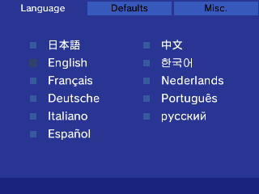
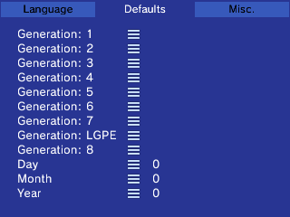
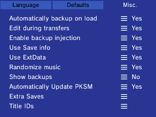
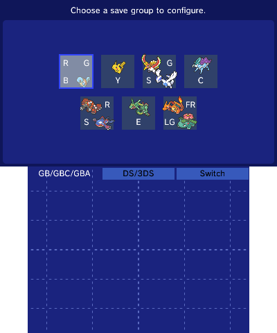
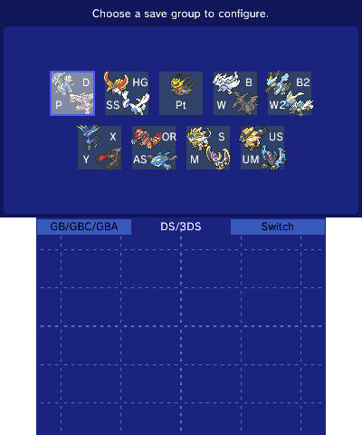
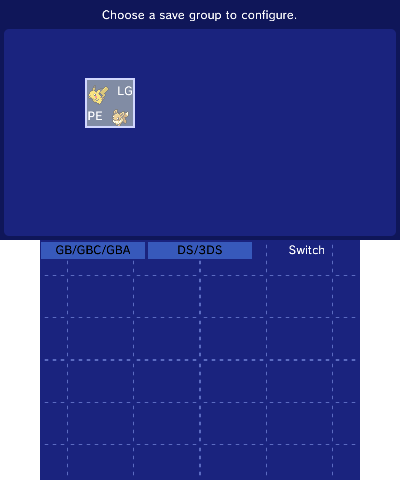
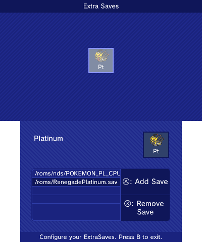
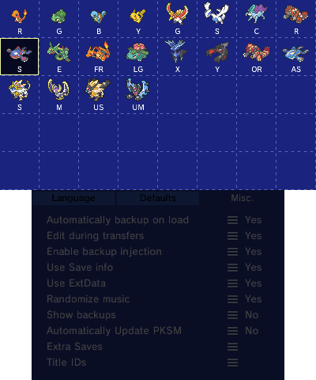

In Settings you can modify certain behaviors of PKSM. Each tab has it's own settings.

> This screen can only navigated with the touch screen, except to exit which can be done by pressing `B`.

### Tab 1: Language

This screen is used to set the language of PKSM.

To change the language tap the box next to the language you wish to use.

### Tab 2: Defaults
This tab lists a variety of default values for PKSM to use for certain operations.

`Day`, `Month`, and `Year` make up the date that PKSM will use when injecting Events into a save.

> Tip: Setting any of the date defaults (Day, Month, Year) to 0 will make PKSM use that portion of the system's current date.

Starting with PKSM v9.0.0, each supported generation gets a "default template" which is used as the starting point when generating Pokémon from scratch. Tapping the `≡` next to a generation will bring up the Editor screen, where you can edit the template. Any Pokémon you generate will share everything with this template except the following:

> **Warning**: Editing the template for a generation that does not match the loaded save is not recommended as it may allow otherwise impossible values to be selected.

- Species
- Form
- Nickname
- Ability
- PID

Additionally, if you have the Misc. setting `Use Save Info` turned on then the following will also be ignored and instead based on your loaded save:

- OT Name
- OT Gender
- TID
- SID
- Origin game
- Met location (will be set to the game's Route 1)

### Tab 3: Miscellaneous Settings
On this screen, you're able to change miscellaneous functions.

- Automatically backup on load:
    - This will back up your game's save file when you first load it into PKSM.
    - This will also back up PKSM's bank storage when you load the bank.
    - This setting is turned **on** by default.
- Edit during transfers:
    - When transferring Pokemon from your bank to your game, PKSM will edit it to make sure that the Pokemon's information is compatible with the game.
    - This setting is turned **on** by default.
    - **Note**: this setting is required to be true if you want to perform a bulk swap of Pokemon from one generation to another.
- Enable backup injection:
    - When saving a edits made to an SD save and the game cart is inserted (DS/3DS) or installed (3DS), provides an option to copy the save over the save in the cartridge/installed title
    - This setting is turned **off** by default
- Use Save info:
    - Instead of using some information like the TID or SID from the defaults settings, PKSM will attempt you pull the information from your save file and use it for generating Pokemon.
    - This setting is turned **off** by default.
- Use ExtData:
    - PKSM 6.0.0 introduced the usage of ExtData for bank data, that way backups can easily be done through Checkpoint.
    - If you don't know what you're doing, don't touch this option; it is provided solely for people with unique setups or issues.
    - This setting is turned **on** by default
- Randomize music:
    - If you have music on your SD card located under `sdmc:/3ds/PKSM/songs` it will play the songs in a random order, rather than playing it in order of title.
    - If you have no music on your SD card, this setting will not do anything.
    - This setting is turned **off** by default.
- Show backups:
    - Enabling this setting makes PKSM show the backups that it creates in the save select screen.
    - This may cause some startup lag
    - This setting is turned **off** by default
- Automatically Update PKSM
    - Enabling this settings makes PKSM check for application and Mystery Gift database updates each time you open it.
    - This setting is turned **on** by default.
- Extra Saves:
    - See the [Extra Saves](#extra-saves) section below for information on this option
- Title IDs
    - See the [Title IDs](#title-ids) section below for information on this option

## Extra Saves
Using the menu introduced in PKSM v7.0.0, it is possible to configure PKSM to edit a save from anywhere on the SD card. In order to do this, you must direct PKSM to the save file (not the ROM) using the file selector provided.

Upon selecting this option you will be presented with a screen that looks similar to the game selection screen, where you choose which game you want to add/remove an extra save for.

Once you have chosen a game you will see a screen similar to below

To configure a new extra save for PKSM to list, press `A`. This will bring up a list of the contents of your SD card. Just navigate to the save file and select it.

To delete a configured extra save, scroll through the list on the bottom screen until it's highlighted and press `X`.

Once you're done adding or removing extra saves, just back out to the Settings screen and continue where you left off.

To edit your extra save, pick the game on the game selection screen then select the save from the list of files.

> When trying to load the save to edit, if the extra save's game is not the inserted cart or installed to the 3DS's Home Menu, press `Y` to bring up the Absent Games screen.

## Title IDs
Starting with v9.0.0 you can set custom title IDs for most supported games installed on your 3DS. Tapping the `≡` next to Title IDs will bring up the overlay you see below, allowing you to choose a game to set a custom title ID for.

Once you select a game, a keyboard will pop up where you can type in the ID you want to set for the game. When you back out of Settings, PKSM will re-check your SD card for titles and saves and your configured title should show up on the game selection screen.
