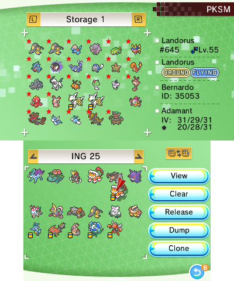
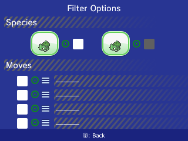
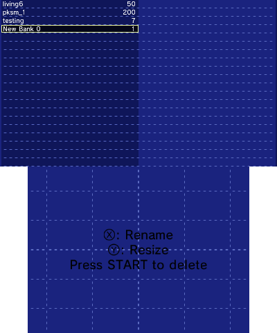

The Storage section of PKSM allows you to move around your Pokémon from generations 1 through 8 between your loaded save and any banks (storage groups) you've made on your console.

> A couple notes:
> - Most screens in this section come with a bit of help that can be viewed by holding `Select`.
> - You need to have received your starter before PKSM will let you use this in the save file.

The top screen displays the contents of your currently loaded bank (storage) and a brief summary of the Pokémon under the cursor. The bottom screen shows the contents of your save's PC and a set of buttons for interacting with the focused Pokémon or box.

> #### Generation marks
> The marks shown in the brief summary on the top screen represent the generation that the Pokémon was last in:
> - `III` for Generation 3 (R/S/FR/LG/E)
> - `IV` for Generation 4 (D/P/PT/HG/SS)
> - `V` for Generation 5 (B/W/B2/W2)
> - a *pentagon* for Generation 6 (X/Y/OR/AS)
> - a *clover/cross* for Generation 7 (S/M/US/UM)
> - a *GameBoy icon* for Generations 1 (R/G/B/Y) and 2 (G/S/C)
> - ? for LGPE
> - nothing for Generation 8 (SW/SH)

Most of the buttons on the right side of the bottom screen should be easy to understand.

- **View**: show more detailed info on the top screen about the Pokémon under the cursor
- **Clear**: deletes every Pokémon in the box the cursor is over
- **Release**: deletes (releases) the selected Pokémon
- **Dump**: Writes the selected Pokémon to a `.pkx` file on your SD at `sdmc:/3ds/PKSM/dumps`
- **Clone**: makes a copy of the selected Pokémon

The orange button above "View" is the "Swap Boxes" button, that exchanges the entire contents of the current bank box with the current save box.

The last of the not-so-obvious buttons on the bottom screen is the wireless one in the bottom left. This button brings you to a screen that looks similar to the current one: the [GPSS](./GPSS).

One other less visible function is a management staple: box naming. All you need to do is press `A` while hovering the cursor over the box name bar and a keyboard will pop up letting you input a new name of 1 to 20 characters in length.

## Start Menu
Pressing `Start` brings up a sub-menu with a few extra options:

- **Sort**: rearrange all Pokémon in either the bank or save, depending on where the cursor is hovering
- **Filter**: grey out the sprites of Pokémon based on a set of filters (see Filter below)
- **Switch box**: allows you to quickly jump to a certain box in the save or bank, depending on which the cursor is hovering over
- **Storage group**: opens the screen for managing your banks (see Storage group below)

### Filter
The `Filter` button brings up a new screen with a few options for filtering your collection.

The way they work is pretty simple:

1. tap the checkbox next to the filter you want to activate so that it is green
2. select an option for the filter
3. (optional) change the green plus/red minus next to the filter to pick whether the filter greys out those that *don't* (green plus) or *do* (red minus) match
4. press `B` to apply the filter(s) and return to the box view

For the `Species` filter, the left option controls the species and the right option controls the form of the species.

### Storage Group
The `Storage Group` option opens a new screen where you can manage your banks.

- **Create new storage group**: Scroll down to `New Bank #` and press `A`. The new bank will still be named `New Bank #` and only be 1 box, but those can be changed.
    - The maximum number of banks you can create is about 90.
- **Delete storage group**: Scroll to the bank you want to delete and press `Start`. A confirmation prompt will pop up asking if you're sure you want to delete the bank.
- **Rename storage group**: Scroll to the bank you want to rename and press `X`. A keyboard will pop up allowing you to type in a new name of 10 characters or less.
- **Resize storage group**: Scroll to the bank you want to resize and press `Y`. A number pad will pop up allowing you to change the number of boxes in the bank to a number from 1 to 500.

## Cursor Mode
The cursor used to navigate Storage has multiple modes, which are colored and behave like the cursor in the "Move Pokémon" or "Organize Boxes" modes in-game. Pressing `Y` will change the cursor mode and color, cycling from red to blue to green and back to red. Each mode slightly changes what pressing `A` does:

- **Red**: picks up the Pokémon under the cursor or places the held Pokémon in an empty slot
- **Blue**: swaps the currently held Pokémon with the one in the slot underneath (if one of the two is empty this behaves like the red cursor)
- **Green**: behaves similarly to the "group move" cursor in-game--first press of `A` starts the selection box, the second press ends the box and picks up all Pokémon within the selection, and the third press places the held group or swaps it with the matching group in the box under the cursor.

> ### About Group Mode Cloning
> To clone a group, highlight the group as normal but press the "Clone" button *before* picking up the group.

## Limits on Moving Pokémon
Pokémon cannot be moved into just any save. In order to be moved from storage into a save, the Pokémon must be compatible with it. Some reasons a Pokémon can't be moved into the save:

- Species does not exist in the save's game
- Form does not exist in the save's game
- Ability does not exist in the save's game
- One or more moves do not exist in the save's game
- The Pokémon has already been in (or came from) a LGPE save and your loaded save is *not* LGPE or SWSH
- The Pokémon has already been in (or came from) a SWSH save and your loaded save is *not* SWSH

### Emergency Mode
For those cases where a Pokémon cannot be moved into a save, there is a *hidden* Emergency Mode editor that can be accessed to try to make it compatible.

If you need to access the Emergency editor, you have the following options to learn how to open it:

- join the [FlagBrew Discord server](https://discord.gg/bGKEyfY) and ping `piepie62#3412`
- read through the source code

One last note: Emergency Mode assumes that the Pokémon you're trying to edit is appropriate for the save you have loaded, so unusual behavior may arise while trying to edit something that clearly doesn't belong (like trying to edit a Meltan with a USUM or earlier save loaded).
